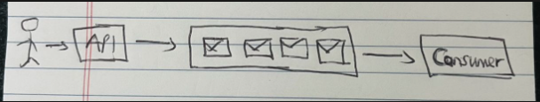
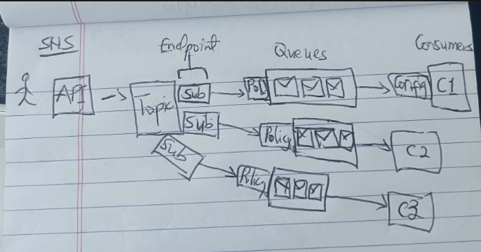

## AWS Cloud
Web service development with integration and interaction with cutting-edge AWS Cloud technologies; 

1. SQS as Message Queue, 
2. SNS, 
3. S3, 
4. Secrete Manager, 
5. DynamoDB, 
6. Lambda

### AWS SQS and SNS Architecture
**SQS**

- Queue Types: Standard and FIFO
- Publisher/Consumer (1-to-1)
- Dead Letter Queues (DLQ)

**SNS**

- Publisher/Consumer (1-to-many)
- Message filtering

[Read more...](https://www.notion.so/Cloud-Fundamentals-AWS-Services-for-C-Developers-ae73c952d37549b48ed33fbdb7acde60?pvs=4)

